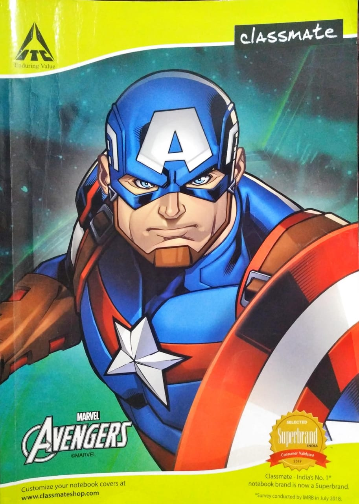
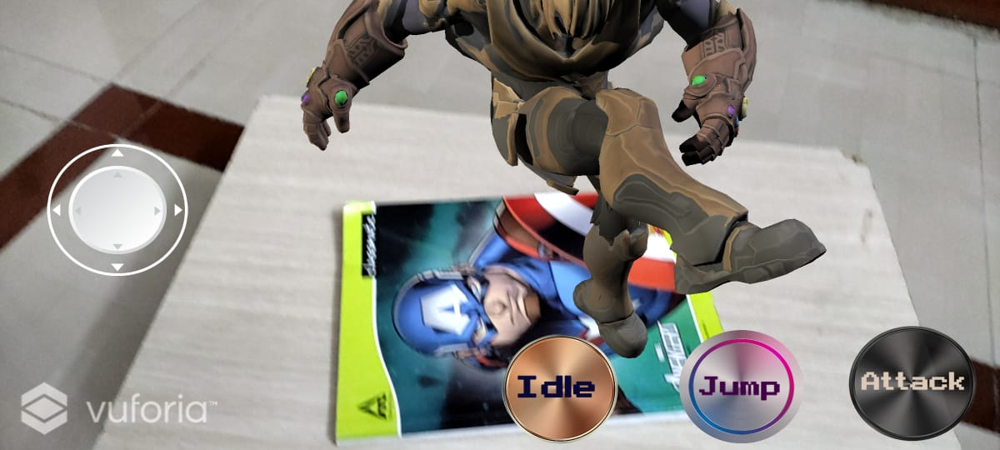
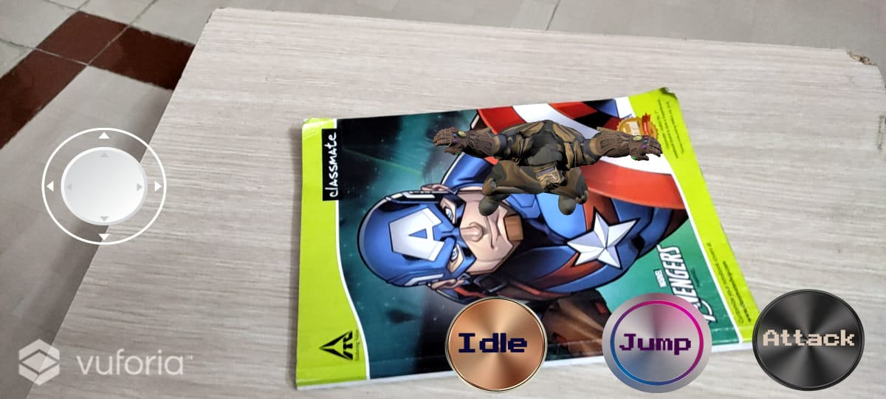
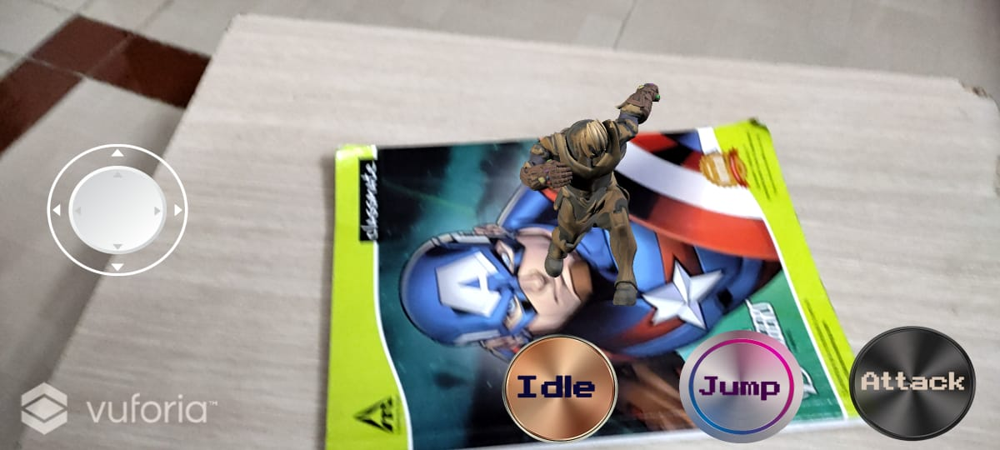

# 3D-Augmented-Reality
 Marker Based 3D Augmented Reality Application.  The objective of this project is to design a 3D human figure model with animations and develop an AR application for the same which will include several functionalities to control the humanoid model in 3D-AR space.
The project will include modeling of a human figure using one of the 3D modeling techniques in a software like Unity and Blender and then adding animations to the model.
Then  project is integrated into an android application which will access the phone camera.

# Introduction
Augmented Reality (AR) turns the environment around you into a digital interface by placing virtual objects in the real world, in real-time. AR can be seen through a wide variety of experiences such as gaming applications, AR browsers, etc.   

# Marker Based AR
This type of AR, also known as recognition-based AR or image recognition, relies on identification of markers/user-defined images to function. Marker-based AR requires a marker to activate an augmentation. Markers are distinct patterns that cameras can easily recognize and process, and are visually independent of the environment around them; they can be paper-based or physical objects that exist in the real world.
Maker-based AR works by scanning a marker which triggers an augmented experience (whether an object, text, video or animation) to appear on the device.

## Tools Required

- Unity 
- Vuforia 
- Android Studio (SDK)
- Java Development Kit (JDK)
- Blender
## Database

- The Vuforia Target Manager is a web-based tool that enables us to create and manage target databases on Vuforia’s developer portal. 
- The purpose of Vuforia Device Database – also referred to as datasets in the SDK – is to provide the AR application with a locally accessible database of targets.
- Once we have successfully added our targets, we can now download the device database or use the target IDs for our application.
# Marker 
Image Target used in this project: 

  

# Features
- **Character controller** : A Character Controller allows one to easily do movement constrained by collisions without having to deal with a rigidbody.
A Character Controller is not affected by forces and will only move when we call the Move function. It will then carry out the movement but be constrained by collisions.
A third person character controller script for AR world space with features to move, rotate, jump and attack along with animations was created. Joystick was added as input for the character Controller.
- **Multiple Animations** : Animator Controllers are state machines that determine which animations are currently being played and blends between animations seamlessly.The Animator Controller has references to the Animation clips used within it, and manages the various Animation
Clips and the Transitions between them. To set up these conditions, we specify values of parameters in the Animator Controller.
- **User Interface** : Buttons and JoystickUI canvas was created with buttons for transitioning between animations (Idle, Jump, Attack and walk). Gradient button icons were created in Photoshop.
A script for Joystick was written for the character controller to move and rotate the character in 3D Augmented reality world space.
- **Touch: Pinch to scale**: Pinch to scale feature was added using Lean Touch in Unity to scale up and scale down the character using fingers pinch. This event gets called every time a finger begins touching the screen, and gets passed a Lean.
Lean Touch was imported from Unity Asset store and added to the character model as component.

# Implementation stages
- AR Image Target settings
- Modeling 
  - Rigging
  - Skinning
- Animation
- App development 
  - Animator Blend Tree for animation Transitions 
  - UI design 
  - Buttons 
  - Joystick 
  - Character Controller
  - Lean Touch: Pinch to Scale 

# Animations
|| |
|:---:|:---:|
|*Idle*|*Walk* |
| ||
|||
|*Kick*|*Jump*|

### Results

  

  

  

|   |  |  |
|:---:|:---:|:---:|
| http://videoblocks.com | http://audioblocks.com | http://graphicstock.com |

### How to Run: 

1. Add the "ar_thanos_app_final.apk" on internal storage of your andorid mobile and install the app.
2. For target image, you will need to print the "cap_cover.jpeg" image in  color format.
3. Open the app on phone and focus the camera on the printed image to generate the 3D AR model.

### Installing project into Unity

1. Install unity hub and editor
2. Install Vuforia AR engine package
3. Import the source code and assets inside a new unity project. (Note: Library folder has not been uploaded in this repo)
4. After importing the source code, you can view the scene and build the application if required.

Copyright © 2021 Rohit Ranjan 
